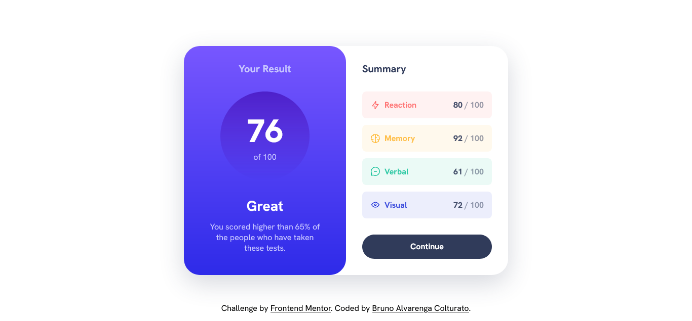

# Frontend Mentor - Results summary component solution

This is a solution to the [Results summary component challenge on Frontend Mentor](https://www.frontendmentor.io/challenges/results-summary-component-CE_K6s0maV). Frontend Mentor challenges help you improve your coding skills by building realistic projects. 

## Table of contents

- [Overview](#overview)
  - [The challenge](#the-challenge)
  - [Screenshot](#screenshot)
- [My process](#my-process)
  - [Built with](#built-with)
  - [What I learned](#what-i-learned)
- [Author](#author)
- [Acknowledgments](#acknowledgments)

## Overview

### The challenge

Users should be able to:

- View the optimal layout for the interface depending on their device's screen size
- See hover and focus states for all interactive elements on the page

### Screenshot



## My process

### Built with

- Semantic HTML5 markup
- CSS custom properties
- Flexbox
- CSS Grid
- Mobile-first workflow
- CSS Attribute Selectors

### What I learned

With this project I had my first contact with CSS atribute selectors and I found them amazing! 

```css
.grid-flow[data-spacing="small"] {
  gap: 0.8rem;
}
```

I also learned to use CSS custom properties inside an element and not only in the `:root` pseudo-class.

```css
.result-summary {
  --padding: 2rem;
  --border-radius: 2rem;
  max-width: 40rem;
  display: grid;
}
```

## Author

- Website - [Bruno Alvarenga Colturato](brunocolturato.github.io)
- Frontend Mentor - [@BrunoColturato](https://www.frontendmentor.io/profile/BrunoColturato)

## Acknowledgments

I would like to thank [Kevin Powell](https://github.com/kevin-powell) for his [tutorial](https://www.youtube.com/watch?v=KqFAs5d3Yl8&list=WL) on this project. The tutorial inspired me and taught me a lot about CSS workflow and techniques. 
